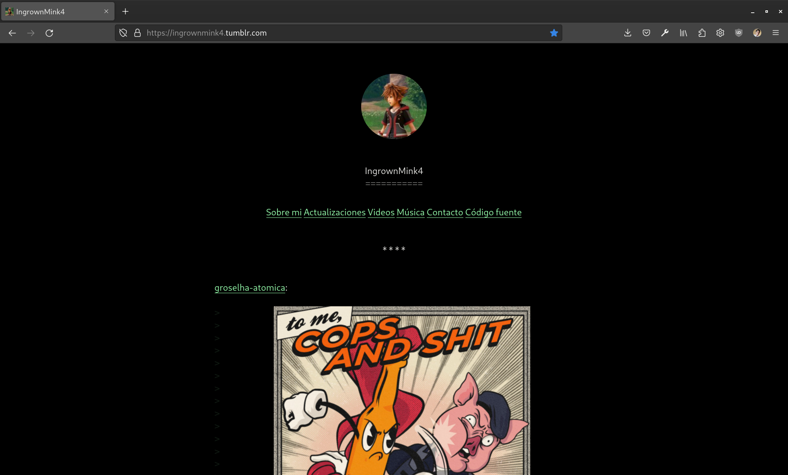
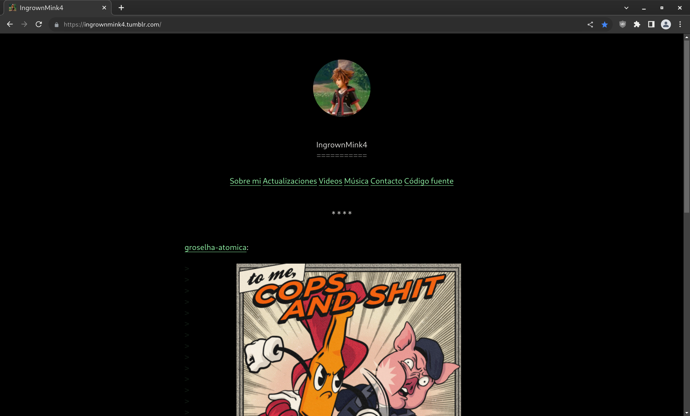

<h2 align= "center"> ingrownmink4.tumblr.com </h2>

 A lightweight and free/libre blog for Tumblr. Used as my personal website (at the moment).
 

 <a href="https://github.com/fvsch/monospace-theme" rel="noopener"> Forked from Florent Verschelde's Monospace theme</a>. Tweaked by me with CSS.

### Built with
- HTML
- SCSS
- JavaScript

### Features
- No tracking
- No ads
- Content Security Policy enabled
- Multiple languages available (eu-ES, es-ES, en-EU)
- Dark mode enabled by default
- Compliant with the latest WCAG accessibility standards
- Much more…

 
 This is what it looks like using:
Firefox|Chrome
---|---
| 

